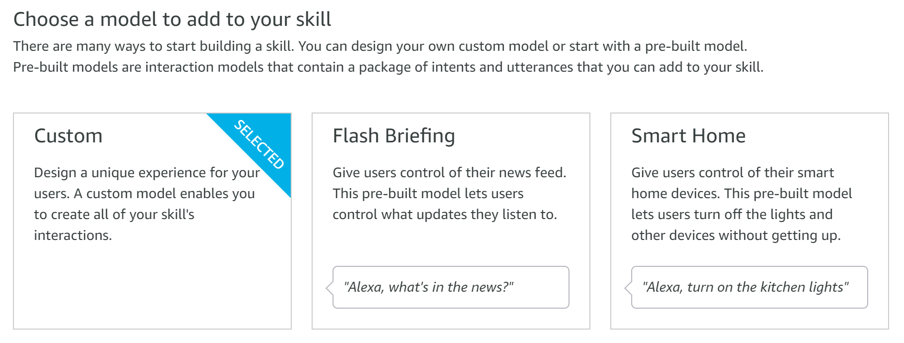
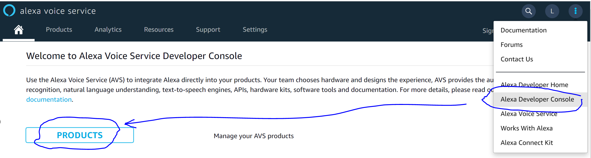
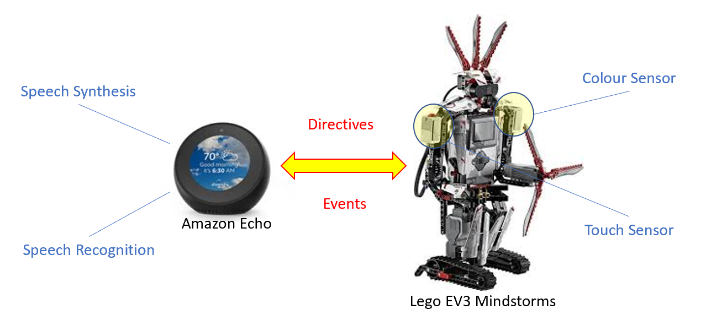

# Alexa Gadget Toolkit (AGT): Integration of Lego EV3 Brick with Amazon Echo
This tutorial can act as a continuation of an excellent [LEGO MINDSTORMS Voice Challenge](https://www.hackster.io/alexagadgets/lego-mindstorms-voice-challenge-setup-17300f) at Hackster.io. So, ideally you should complete all 4 missions from that challenge first and then jump to Step 1 of this tutorial to carry on.

If not, don't worry. Start with Step 0 below to setup the environment and then follow all other steps below in sequence.

## Pre-requisites: 
For this tutorial, you would need the following hardware components:
- Lego Mindstorms EV3 Robotics Kit. See the [Amazon link](https://www.amazon.co.uk/LEGO-31313-MINDSTORMS-Servo-Motor-Programmable/dp/B00BMKLVJ6);
- Amazon Echo device compatible with Alexa Gadget Toolkit. See the [Documentation link](https://developer.amazon.com/docs/alexa-gadgets-toolkit/understand-alexa-gadgets-toolkit.html#devices);
- Computer with the Internet connectivity and Visual Studio Code IDE. You can download Visual Studio Code from [here](https://code.visualstudio.com/download)


## Step 0 - Setup
1. Build your **EV3 robot**, following the instructions from the [Lego manual](https://www.lego.com/cdn/cs/set/assets/blt2fdb839be7a53b96/31313_EV3RSTORM_2016.pdf).
2. Next, install **ev3dev** (Debian Linux based operating system), so that you can launch Python 3.x based applications  on your EV3 Brick. Detailed installation instructions can be found [here](https://www.ev3dev.org/docs/getting-started/)
> **Note:** You need to complete steps 1 to 6 in **eve3dev** installation above. As a reward, in Step 6 EV3 robot will be able to read your fortune :-)
3. Then install **ev3dev-browser** extension as described in [Set up Visual Studio Code](https://www.hackster.io/alexagadgets/lego-mindstorms-voice-challenge-setup-17300f#toc-set-up-visual-studio-code-4).
4. Finally, [set up the Alexa Gadgets Toolkit (AGT) Python Software](https://www.hackster.io/alexagadgets/lego-mindstorms-voice-challenge-setup-17300f#toc-set-up-the-alexa-gadgets-toolkit-python-software-5), so that your EV3 robot can interact via **AGT interface** with your new Alexa skill that you will deploy shortly.

## Step 1 - Create your Alexa skill
1. Sign in with your Amazon developer account at [developer.amazon.com](https://developer.amazon.com/). If you don't have an account yet, you can create new one.
2. Then from the top menu select **Alexa -> Alexa Skills Kit**. 
3. Press **Create Skill** button and provide a name and default language for your new Alexa skill. 
4. In "Choose a model to add to your skill†section select **Custom**. 
5. In "Choose a method to host your skill's backend resources" section select **Alexa-Hosted (Node.js)**. 
6. Then press **Create skill** button in the upper right corner. It will take about one minute to create your skill and open it in Alexa Developer Console.
7. From the left navigation bar select **Interfaces**, then on the right side activate **Custom Interface Controller**. It will allow Echo device to send commands / directives to EV3 Brick and receive events from it back. 
8. Now from the left navigation bar select **JSON Editor**, then replace schema definition on the right with content from Git-attached **alexaskill-nodejs/model.json** file. 
9. Then **Save Model** and **Build Model** using buttons in the upper part of the screen. 
10. From the top navigation bar select **Code**, then copy content of Git-attached **alexaskill-nodejs/lambda/index.js, alexaskill-nodejs/lambda/package.json and alexaskill-nodejs/lambda/util.js** into relevant files under shown **Skill Code/lambda** directory. 
11. Click **create file** icon, enter the name as **lambda/common.js** and copy there content from Git-attached **alexaskill-nodejs/lambda/common.js**. 
12. **Save** all the changes, and the **Deploy** your Alexa skill, using relevant buttons in the upper part of the screen. 
13. Upon successful deployment, from the top navigation bar select **Test**, then enable testing in **Development**. 
14. Open your skill using Skill Invocation Name, e.g. "**open robot dice roller**". As you are using simulator, you should get a response, stating "**I couldn't find an EV3 Brick connected to this Echo device. Please check to make sure your EV3 Brick is connected, and try again.**". It proves that the new Alexa skill is functional, but cannot connect to EV3 Brick yet - something that we'll look at in the next step of this tutorial. 
> **Note:** Invocation name can be set or changed in Alexa skill's **Build** section of Developer Console.

## Step 2 - Alexa Gadget registration
Your EV3 Brick needs to be registered as an **Alexa Gadget** to enable its integration and data exchange with compatible Echo device. 
1. If you are still in Alexa Developer Console, click vertical ellipsis, select **Alexa Voice Service** option and then press **Products** button. 
2. Click **Create Product** button in the top right corner of the screen and fill in all the required fields. Ensure, that the product type is set to ***Alexa Gadget***, and the product category to ***Animatronic or Figure***. 
3. Open newly created Product record and copy details of the system-generated **Amazon ID** and **Alexa Gadget Secret**. 
4. Copy those details into **agt-python/mission-dice.ini**, downloaded from this Git repo. 
> **Note:** EV3 robot will use these credentials to authenticate itself and establish Bluetooth connectivity with the Echo device in Step 3 below.

## Step 3 - Test EV3RSTORM with the Alexa skill
After completion of all the steps above we should have now Alexa skill hosted in the cloud and relevant credentials obtained for EV3 Brick function as an Alexa Gadget. Now, it's the moment of truth - to that EV3 and Echo can work in tandem.

1. First of all, you need to activate Bluetooth on EV3 Brick. Navigate to its **Wireless and Networks** menu, select **Bluetooth** and set it **on**.
2. Second, open extract of this Git repo in Visual Studio Code. On EV3 side, only content of **agt-python** will be utilised: **mission-dice.ini** (which you updated in Step 2 above) and **mission-dice.py** (the actual EV3's logic, written in Python). From the lower part of the screen extend **EV3DEV Device Browser**, connect to your EV3 Brick and click **Send workspace to device** icon. It should upload our program to EV3 Robot's flash storage. 
3. In **EV3DEV Device Browser**, right click your EV3 Brick and select **Open SSH Terminal**. You can execute now any commands directly on EV3. 
4. In SSH terminal switch to the directory holding your **mission-dice.ini** and **mission-dice.py**, e.g.
```
cd agt-python
```
then launch the program itself
```
sudo python3 mission-dice.py
```
If asked for a password, use **maker** (default password, unless you've changed it to something else). In a few minutes, EV3 should confirm that it has connected to Echo device. 

Congratulations !! You have completed all the technical steps and should have now a paired EV3 + Echo solution. Go ahead and use it to roll some virtual dice in your favourite board game(s) !!

## High level overview of the solution design
We combine EV3 Brick and Amazon Echo's strengths in this solution. Echo device equipped with the new Alexa skill will provide speech recognition and speech synthesis capabilities, while EV3 Brick will use its colour sensor to identify the colour of the shown token or card, and its touch sensor to detect the haptic input from the player. 

If you'll check **index.js** of the hosted Alexa skill, you will see that upon activation of the skill through its invocation name, e.g.
```
"Alexa, open robot dice roller"
```
it will use **LaunchRequestHandler** to verify token provided by EV3 Brick. If successful, Echo device will verbally confirm interface activation. It will also keep handling events from EV3 Brick for 10 minutes as per below overwriting shorter system's default timeout settings.
```
    let speechOutput = "Ho-ho-ho, Chappie's voice interface activated";
        return handlerInput.responseBuilder
            .speak(speechOutput + BG_MUSIC)
            .addDirective(Util.buildStartEventHandler(token,60000, {}))
            .getResponse();
```
Next, we'll use Alexa voice command to activate game mode.
```
"Alexa, activate game mode"
```
Echo device will use its **SetCommandIntentHandler** to send a directive to EV3 Brick with the command name, and confirm verbally activation of the new command.
```
    let directive = Util.build(endpointId, NAMESPACE, NAME_CONTROL,
        {
            type: 'command',
            command: command,
            speed: speed
        });

    let speechOutput = `command ${command} activated`;
    return handlerInput.responseBuilder
        .speak(speechOutput + BG_MUSIC)
        .addDirective(directive)
        .getResponse();
```
On EV3 side we should have **mission-dice.py** application running. Its **on_custom_mindstorms_gadget_control** function will extract command name from the payload, set **quiz mode** on and fire event back to Echo, to request player's token.
```
    if command in Command.QUIZ.value:
        self.quiz_mode = True
        self._send_event(EventName.SPEECH, {'speechOut': "Show me your coloured token"})
```
Players in turn would need to show their tokens / cards to EV3 Brick by holding them 5-10mm above his colour sensor (left shoulder, if you assembled the robot as per the original Lego instruction) and then press its touch sensor (right shoulder, if you assembled the robot as per the original Lego instruction).

EV3 had its colour sensor set in Lego bricks colour detection mode, as per the configuration on line 69.
```
self.cl.mode = 'COL-COLOR'
```
So, while **quiz mode** is **on**, it will check whether touch sensor is being pressed. If yes, it will read detected colour code from the colour sensor and send it as a part of **Touch** event back to Echo device.
```
    while self.quiz_mode:
        if self.ts.is_pressed:
            print("Touch sensor pressed. Sending event to skill")
            self.leds.set_color("LEFT", "RED", 1)
            self.leds.set_color("RIGHT", "RED", 1)
            self._send_event(EventName.TOUCH, {'answer': self.cl.value()})
            # self.quiz_mode = False
        time.sleep(0.2)
    time.sleep(1)
```
In Alexa skill's **index.js** file in line 30 we provided Echo with the array of colours that EV3's colour sensor can return.
```
const COLOR_NAMES = ["No color", "Black", "Blue", "Green", "Yellow", "Red", "White", "Brown"];
```
So, when Echo device receives an event and its **EventsReceivedRequestHandler** verifies that it's a **Touch** specific one, it will read the code. If it's bigger than 0, i.e. colour sensor was able to determine the colour, Alexa skill will generate a random number between 2 and 12 to simulate dice roller and then will instruct relevant player on how many steps he / she needs to take.
```
    if (name === 'Touch') {
        let answer = parseInt(payload.answer);
        if (answer > 0) {
            var dice = Math.floor(Math.random() * (+DICE_MAX - +DICE_MIN)) + +DICE_MIN; 
            let playerColor = COLOR_NAMES[answer];
            let speechOutput = ("Player " + playerColor + ", please make " + dice + " steps ahead");
            return handlerInput.responseBuilder
                .speak(speechOutput, "REPLACE_ALL")
                .withShouldEndSession(false)
                .getResponse();
        }
    }
```
That's all ! Now try it for yourselves. And as they used to say in "Hunger Games", **may the odds be ever in your favor!!**.

## Working model - Demo
You can find short demo of the working solution here on [YouTube](https://youtu.be/Gui9sqyglFw)

