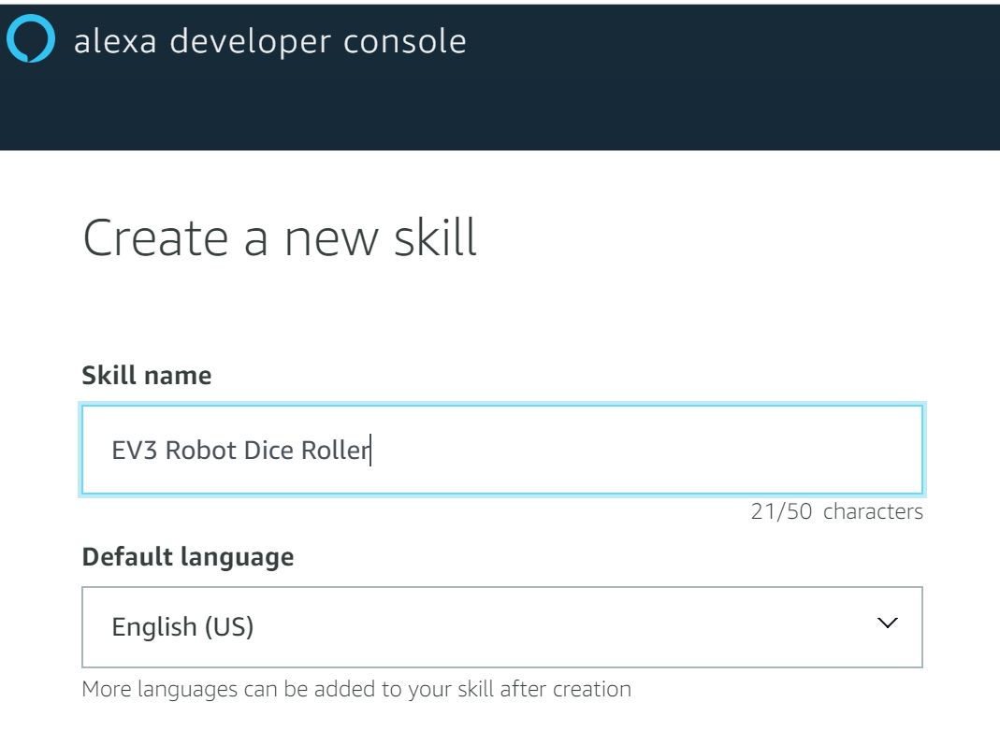

# Alexa Gadget Kit (AGT): Integration of Lego EV3 Brick with Amazon Echo
This tutorial can act as a continuation of an excellent [LEGO MINDSTORMS Voice Challenge](https://www.hackster.io/alexagadgets/lego-mindstorms-voice-challenge-setup-17300f) at Hackster.io. So, ideally you should complete all 4 missions from that challenge first and then jump to Step 1 of this tutorial to carry on.

If not, don't worry. Start with Step 0 below to setup the environment and then follow all other steps below in sequence.

## Pre-requisites: 
For this tutorial, you would need the following hardware components:
- Lego Mindstorms EV3 Robotics Kit. See the [Amazon link](https://www.amazon.co.uk/LEGO-31313-MINDSTORMS-Servo-Motor-Programmable/dp/B00BMKLVJ6);
- Amazon Echo device compatible with Alexa Gadget Toolkit. See the [Documentation link](https://developer.amazon.com/docs/alexa-gadgets-toolkit/understand-alexa-gadgets-toolkit.html#devices);
- Computer with the Internet connectivity and Visual Studio Code IDE. You can download Visual Studio Code from [here](https://code.visualstudio.com/download)


## Step 0 - Setup
1. Build your **EV3 robot**, following the instructions from the [Lego manual](https://www.lego.com/cdn/cs/set/assets/blt2fdb839be7a53b96/31313_EV3RSTORM_2016.pdf).
2. Next, install **ev3dev** (Debian Linux based operating system), so that you can launch Python 3.x based applications  on your EV3 Brick. Detailed installation instructions can be found [here](https://www.ev3dev.org/docs/getting-started/)
> **Note:** You need to complete steps 1 to 6 in **eve3dev** installation above. As a reward, in Step 6 EV3 robot will be able to read your fortune :-)
3. Then install **ev3dev-browser** extension as described in [Set up Visual Studio Code](https://www.hackster.io/alexagadgets/lego-mindstorms-voice-challenge-setup-17300f#toc-set-up-visual-studio-code-4).
4. Finally, [set up the Alexa Gadgets Toolkit (AGT) Python Software](https://www.hackster.io/alexagadgets/lego-mindstorms-voice-challenge-setup-17300f#toc-set-up-the-alexa-gadgets-toolkit-python-software-5), so that your EV3 robot can interact via **AGT interface** with your new Alexa skill that you will deploy shortly.

## Step 1 - Create your Alexa skill
1. Sign in with your Amazon developer account at [developer.amazon.com](https://developer.amazon.com/). If you don't have an account yet, you can create new one.
2. Then from the top menu select **Alexa -> Alexa Skills Kit**. 
3. Press **Create Skill** button and provide a name and default language for your new Alexa skill. 
4. In "Choose a model to add to your skill” section select **Custom**. 
5. In "Choose a method to host your skill's backend resources" section select **Alexa-Hosted (Node.js)**. 


## Step 2 - Alexa Gadget registration

## Step 3 - Test EV3RSTORM with the Alexa skill


```
pip install paho-mqtt
```

## Working model - Demo
You can find short demo of the working solution here on [YouTube](https://youtu.be/Gui9sqyglFw)

